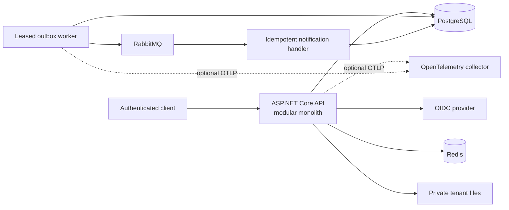
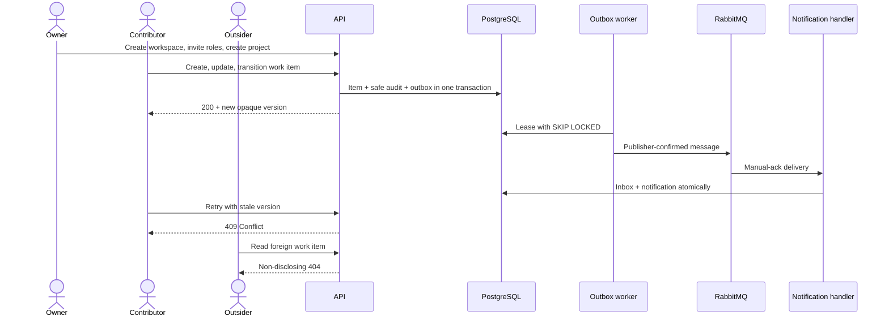

# WorkOps.Platform

A production-minded multi-tenant workflow API built with ASP.NET Core and .NET 10.

It demonstrates tenant isolation, OIDC/JWT authentication, permission-based authorization,
PostgreSQL/EF Core persistence, Redis caching, reliable outbox processing, RabbitMQ messaging,
secure file handling, OpenTelemetry observability, and GitHub Actions delivery.

> Portfolio project by Adnan Alloh, Senior .NET Backend Engineer. All users, organizations, data,
> credentials, and infrastructure values in this repository are synthetic and local-only.

## Status

**Portfolio release candidate - not a production deployment.** Local verification on 2026-08-01
completed with a zero-warning Release build, 88 passing tests, 90.7% line coverage, and 49.7% branch
coverage. Hosted GitHub Actions verification is pending the private first push; CI enforces floors
of 70% and 35%. There is no hosted demo, and no public release is claimed.

- **Implemented:** tenant/identity boundary, projects and work items, audit/outbox/messaging,
  notifications, Redis-backed feature limits, secure attachments, observability, hardening, and
  release automation.
- **Evidence boundary:** local results are dated above; dependency, history, and image scans remain
  configured hosted gates rather than timeless pass claims.
- **Local demo:** one command runs the real containerized golden scenario with synthetic users.
- **Production boundary:** the development file scanner, temporary file storage, local identity
  realm, and local credentials must be replaced for a real deployment.

## Thirty-second overview

WorkOps.Platform is a compact modular monolith for workspaces that manage projects and work items.
Its purpose is to make difficult backend concerns easy to inspect: verified tenant context,
least-privilege roles, optimistic concurrency, atomic audit/outbox writes, at-least-once delivery
with idempotent effects, bounded file handling, safe diagnostics, and repeatable delivery controls.

The design keeps business boundaries explicit without manufacturing a microservice estate. Every
major claim below links to code, tests, or an operational artifact.

## Real adapters and demonstration adapters

| Boundary | Portfolio implementation | Production expectation |
|---|---|---|
| Database, cache, messaging | Real PostgreSQL, Redis, and RabbitMQ containers | Managed or operated services with production credentials, TLS, backup, and monitoring |
| Identity | Local Keycloak realm with synthetic users | Production OIDC provider configuration and lifecycle controls |
| File scanning | Fail-closed port with a no-op Development adapter | Monitored malware-scanning service |
| File storage | Private tenant-separated local paths | Durable object storage with retention and recovery controls |
| Telemetry | Real instrumentation; OTLP export is opt-in | Authenticated collector and monitored backend |

## Architecture



The five production projects keep HTTP contracts, use cases, invariants, and adapters separate.
Architecture tests enforce dependency direction, model-driven tenant filter coverage, public
contract isolation, and sanitization coverage. Persistence also rejects tenant-owned writes that
do not match an explicit request, background, or provisioning context. See
[architecture](docs/architecture.md).

## Golden scenario



The live script also checks that a viewer receives `403`, an exact project replay returns the original
`201`, and transition audit plus notification evidence becomes visible. See the
[demo guide](docs/demo.md) and [functional golden-flow test](tests/WorkOps.FunctionalTests/TenantIdentityEndpointTests.cs).

## Key engineering decisions

| Concern | Decision | Evidence |
|---|---|---|
| Tenant isolation | Establish workspace context from a validated subject plus active membership; default-deny query filters, a save-time write guard, and composite ownership constraints back the boundary | [ADR 0002](docs/adr/0002-tenant-isolation.md), [middleware](src/WorkOps.Api/Tenancy/WorkspaceContextMiddleware.cs), [tests](tests/WorkOps.IntegrationTests/TenantQueryFilterTests.cs) |
| Authorization | Central role-to-permission mapping with endpoint policies; tenant IDs never grant access by themselves | [permissions](src/WorkOps.Domain/Tenancy/Permissions.cs), [authorization handler](src/WorkOps.Api/Authorization/PermissionAuthorizationHandler.cs) |
| Concurrent edits | Return opaque PostgreSQL `xmin` tokens and reject stale writes with `409 Conflict` | [work-item service](src/WorkOps.Application/WorkItems/WorkItemService.cs), [golden-flow test](tests/WorkOps.FunctionalTests/TenantIdentityEndpointTests.cs) |
| Reliable delivery | Store the business change, safe audit, and outbox atomically; lease, confirm, retry, and deduplicate downstream effects | [ADR 0003](docs/adr/0003-outbox-delivery.md), [outbox processor](src/WorkOps.Application/Messaging/OutboxProcessor.cs) |
| Caching and limits | Cache only tenant-scoped entitlement snapshots; enforce project quotas in PostgreSQL, never Redis | [feature service](src/WorkOps.Application/Features/FeatureService.cs), [integration tests](tests/WorkOps.IntegrationTests/TenantQueryFilterTests.cs) |
| File handling | Bound reads, allowlist name/media/signature combinations, scan before storage, use opaque private tenant paths | [ADR 0005](docs/adr/0005-file-storage-security.md), [attachment service](src/WorkOps.Application/Files/AttachmentService.cs) |
| HTTP retries | Scope idempotency by tenant, user, method, route, and key; reject changed input under the same key | [ADR 0006](docs/adr/0006-http-idempotency.md), [project service](src/WorkOps.Application/Projects/ProjectService.cs) |

## Security highlights

- strict JWT issuer, audience, signature, lifetime, algorithm, and subject validation;
- active-membership workspace resolution and non-disclosing cross-workspace denial;
- explicit request contracts, named sanitization profiles, body/header/page bounds, and safe Problem
  Details with generated correlation and trace IDs;
- tenant-filtered persistence with a matching write guard and composite ownership constraints;
- role policies, assignment boundaries, state-transition allowlists, and optimistic concurrency;
- bounded file reads, filename/media/signature validation, fail-closed scanner port, hashes, opaque
  names, and storage outside the web root;
- deny-by-default CORS, user/IP rate limiting, HSTS/HTTPS production rules, security headers, and
  Development-only OpenAPI JSON;
- structured logs and low-cardinality telemetry that exclude submitted values from tested paths;
- locked dependencies, full-commit workflow pins, Gitleaks, CodeQL, dependency review, NuGet audit,
  coverage floors, and high/critical image scanning;
- tag-gated release verification, commit-addressed container tags, SPDX JSON SBOM, and digest
  evidence, with publication protected by a reviewable environment.

See [security controls](docs/security.md), [threat model](docs/threat-model.md), and the
[OWASP ASVS 5.0 evidence map](docs/asvs-map.md). This project does not claim certification.

## Quick start

Prerequisites: Docker Desktop. The Bash demo also needs `curl` and `jq`; the PowerShell demo needs
PowerShell 7.

macOS/Linux:

```bash
./scripts/demo.sh --start
```

PowerShell:

```powershell
./scripts/demo.ps1 -Start
```

The first identity-provider import can take up to two minutes. Later runs reuse
`.local/demo-state.json`, recheck the stale-write and tenant boundaries, and create no duplicate
demo records. Stop the stack without deleting its database with `docker compose down`.

For a code-only start:

```bash
dotnet restore --locked-mode
dotnet run --project src/WorkOps.Api
```

## Demo


The script obtains local synthetic tokens without displaying them, creates two workspaces, assigns
contributor and viewer roles, replays an idempotent project request, executes the work-item flow,
checks `403`, `409`, and `404` boundaries, and waits for audit/outbox notification evidence.

Use [demo/workops.http](demo/workops.http) to inspect each request manually. Change its `runId`
before a fresh run. The imported local users are `demo-owner`, `demo-contributor`, `demo-viewer`,
and `demo-outsider`; their shared password is the explicit local-only value in the collection and
realm file. Never use the development realm or credentials in a deployed environment.

## Testing

```bash
dotnet restore --locked-mode
dotnet format --verify-no-changes --no-restore
dotnet build -c Release --no-restore
dotnet test -c Release --no-build --logger "trx" --collect:"XPlat Code Coverage"
```

The 88 tests comprise 51 unit, 13 PostgreSQL/Redis/RabbitMQ/storage integration, 18 full-host
functional, and 6 architecture tests. The dated local result is 90.7% line and 49.7% branch
coverage. CI merges coverage, publishes HTML/Cobertura/Markdown evidence, and enforces the 70% line
/ 35% branch floors. A scheduled/manual workflow runs the complete Compose golden scenario and
retains sanitized evidence. See [testing](docs/testing.md).

## Observability and operations

Every response has a server-generated `X-Correlation-Id`; safe Problem Details also include the
correlation and trace IDs. Serilog writes structured JSON. OpenTelemetry instruments ASP.NET Core,
outbound HTTP, PostgreSQL, runtime, messaging, cache results, processing duration, and backlog.
OTLP export is disabled until an endpoint is explicitly configured.

Read [operations](docs/operations.md) for health, message recovery, rate limits, cache/file settings,
diagnostic correlation, and the release process.

## Review paths

- **2-minute hiring-manager tour:** [overview](#thirty-second-overview) -> [architecture](#architecture) -> [demo](#demo)
- **10-minute backend review:** [tenant boundary](src/WorkOps.Api/Tenancy/WorkspaceContextMiddleware.cs) -> [work-item service](src/WorkOps.Application/WorkItems/WorkItemService.cs) -> [outbox worker](src/WorkOps.Infrastructure/Messaging/OutboxWorker.cs) -> [golden-flow test](tests/WorkOps.FunctionalTests/TenantIdentityEndpointTests.cs)
- **Security review:** [threat model](docs/threat-model.md) -> [ASVS map](docs/asvs-map.md) -> [security controls](docs/security.md) -> [CI](.github/workflows/ci.yml)
- **Delivery review:** [CI](.github/workflows/ci.yml) -> [release workflow](.github/workflows/release.yml) -> [Dockerfile](Dockerfile) -> [operations](docs/operations.md)

## Repository map

- [`WorkOps.Api`](src/WorkOps.Api) - HTTP adapter and composition root
- [`WorkOps.Application`](src/WorkOps.Application) - use cases and provider-neutral ports
- [`WorkOps.Domain`](src/WorkOps.Domain) - invariants and domain behavior
- [`WorkOps.Infrastructure`](src/WorkOps.Infrastructure) - persistence and external adapters
- [`WorkOps.Contracts`](src/WorkOps.Contracts) - deliberately versioned public contracts
- [`tests`](tests) - unit, integration, functional, and architecture evidence
- [`demo`](demo) - manual HTTP collection
- [`docs`](docs) - architecture, security, operations, testing, demo, ADRs, and review evidence

## Tradeoffs and ADRs

This is a modular monolith, not a microservice system. PostgreSQL row-level security, a production
OIDC provider configuration, durable object storage, monitored antivirus, a hosted telemetry
backend, signing/provenance attestation, and a hosted demo are deliberately outside the local
portfolio release. The current controls and residual risks are explicit in the ADRs and threat
model.

- [ADR 0001 - modular monolith](docs/adr/0001-modular-monolith.md)
- [ADR 0002 - tenant isolation](docs/adr/0002-tenant-isolation.md)
- [ADR 0003 - outbox delivery](docs/adr/0003-outbox-delivery.md)
- [ADR 0004 - OIDC provider boundary](docs/adr/0004-oidc-provider-boundary.md)
- [ADR 0005 - file storage security](docs/adr/0005-file-storage-security.md)
- [ADR 0006 - HTTP idempotency](docs/adr/0006-http-idempotency.md)

## Roadmap

- [x] Tenant and identity boundary with cross-workspace tests
- [x] Project/work-item slice with optimistic concurrency
- [x] Atomic audit/outbox flow with idempotent notification delivery
- [x] Tenant-aware caching, feature limits, and secure attachment baseline
- [x] Observability, HTTP hardening, security automation, SBOM, and release evidence
- [x] Runnable Bash/PowerShell golden-scenario demo and recruiter review paths
- [ ] Replace local scanner/storage/identity components before any production deployment
- [ ] Add artifact signing and provenance attestation when a public release is intentionally made

See [CHANGELOG](CHANGELOG.md), [CONTRIBUTING](CONTRIBUTING.md), [SECURITY](SECURITY.md), and the
[repository settings checklist](docs/github-settings.md). This project is available under the
[MIT License](LICENSE).
