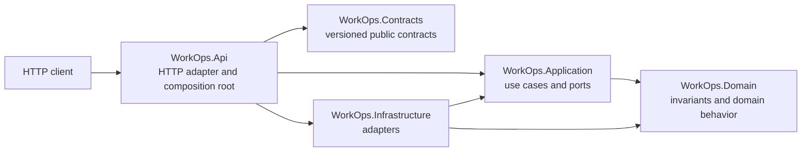

# WorkOps.Platform

A production-minded multi-tenant workflow API being built with ASP.NET Core and .NET 10.

> Portfolio project by Adnan Alloh, Senior .NET Backend Engineer. All names, users,
> organizations, data, and infrastructure values in this repository are synthetic.

## Status

**Caching, limits, and secure-files milestone - not yet a production release.** The repository now
provides tenant-aware Redis feature caching, database-enforced project quotas, and private work-item
attachments in addition to the tenant, concurrency, audit, outbox, RabbitMQ, and notification
capabilities. Broader observability, HTTP hardening, and a runnable demo script remain planned.
There is no hosted demo.

## Thirty-second overview

WorkOps.Platform is a focused backend portfolio project for workspaces that manage projects and
work items. Its purpose is to make difficult backend concerns easy to inspect: tenant-safe data
access, permission-based authorization, optimistic concurrency, transactional outbox processing,
idempotent background work, secure attachments, and production diagnostics.

The design is intentionally a compact modular monolith. It favors clear boundaries and traceable
tradeoffs over a large project graph or unnecessary distributed-system components.

## Architecture



See [architecture](docs/architecture.md),
[ADR 0001: modular monolith](docs/adr/0001-modular-monolith.md), and
[ADR 0002: tenant isolation](docs/adr/0002-tenant-isolation.md), and
[ADR 0003: outbox delivery](docs/adr/0003-outbox-delivery.md), and
[ADR 0005: file storage security](docs/adr/0005-file-storage-security.md).

## Golden scenario

The end-to-end backend scenario is implemented: an owner invites a contributor and creates a
project; the contributor creates, assigns, updates, and transitions a labeled work item; the same
database transaction stores a safe audit event and outbox message; the worker publishes through
RabbitMQ; and an inbox-protected handler records one notification. Tests prove atomic persistence,
real broker routing, harmless duplicate delivery, cross-workspace denial, permission boundaries,
and `409 Conflict` for stale versions. See [demo plan](docs/demo.md).

## Security highlights

Implemented:

- nullable analysis and recommended .NET analyzers with warnings treated as errors;
- committed safe configuration only, with local-secret and key formats ignored;
- pinned stable SDK/runtime container tags and a non-root, read-only container configuration;
- minimal GitHub Actions permissions and full commit-SHA action pins;
- Gitleaks, dependency review, CodeQL, and NuGet audit configuration;
- dependency-direction tests for the initial architecture;
- strict JWT issuer, audience, signature, lifetime, subject, and algorithm validation;
- workspace context derived from validated identity and active membership;
- centralized role-to-permission mapping and endpoint authorization policies;
- default-deny Entity Framework tenant filters with non-disclosing cross-workspace denial;
- explicit input sanitization profiles and automated request-contract coverage;
- tenant-filtered project and work-item persistence with composite ownership constraints;
- contributor/viewer invitation limits plus active-member assignment validation;
- domain-enforced work-item transitions and opaque PostgreSQL `xmin` version tokens;
- bounded, filtered, directly projected list queries;
- tenant-scoped audit, outbox, inbox, and notification rows with relational ownership constraints;
- safe audit metadata and message payloads that exclude work-item titles and submitted content;
- leased outbox claims, five-attempt retry ceilings, deterministic jitter, and recoverable failure;
- RabbitMQ publisher confirms, durable routing, a failed-message queue, and explicit acknowledgments;
- inbox uniqueness that makes notification delivery idempotent under retries;
- permission-protected audit reads and audited failed-outbox replay;
- tenant-derived Redis keys, five-minute feature snapshots, explicit invalidation, and a short
  distributed cache-fill lock;
- PostgreSQL-backed `Starter` and `Team` subscriptions with an optimistic-concurrency protected
  active-project quota;
- bounded attachment reads, filename and media-type allowlists, signature inspection, strict UTF-8
  text validation, scanner-before-storage flow, opaque names, hashes, and private tenant paths;
- tenant-filtered attachment metadata and authorized downloads with `nosniff` responses;
- PostgreSQL migrations and container-backed security regression tests.

Planned controls are documented in [security](docs/security.md) and the
[threat model](docs/threat-model.md). This project does not claim security certification.

## Quick start

Prerequisites: .NET SDK `10.0.302` or a compatible allowed patch, and optionally Docker.

```bash
git clone https://github.com/adnanjalloh/WorkOps.Platform.git
cd WorkOps.Platform
dotnet restore --locked-mode
dotnet test -c Release --no-restore
dotnet run --project src/WorkOps.Api
```

Then open `http://localhost:5000/health/live` using the URL printed by ASP.NET Core.

Docker:

```bash
cp .env.example .env
docker compose up --build
```

PowerShell:

```powershell
Copy-Item .env.example .env
docker compose up --build
```

## Testing

```bash
dotnet format --verify-no-changes --no-restore
dotnet build -c Release --no-restore
dotnet test -c Release --no-build --logger "trx" --collect:"XPlat Code Coverage"
```

The current 73 tests cover the identity and project boundaries plus safe audit metadata, atomic
outbox creation, real PostgreSQL lease contention, deterministic backoff, bounded failure and
replay, real RabbitMQ publishing, internal-message validation, duplicate inbox handling, and a
single visible notification after repeated delivery. They also prove tenant-separated Redis and
file storage, cache invalidation, concurrent quota enforcement, hostile upload rejection, and
cross-workspace download denial. The full strategy and honest gaps are in [testing](docs/testing.md).

## Review paths

- **2-minute hiring-manager tour:** this overview -> [architecture](docs/architecture.md) -> [demo plan](docs/demo.md)
- **10-minute backend review:** [work-item service](src/WorkOps.Application/WorkItems/WorkItemService.cs) -> [outbox worker](src/WorkOps.Infrastructure/Messaging/OutboxWorker.cs) -> [functional test](tests/WorkOps.FunctionalTests/TenantIdentityEndpointTests.cs)
- **Security review:** [threat model](docs/threat-model.md) -> [security controls](docs/security.md) -> [CI](.github/workflows/ci.yml)
- **Delivery review:** [CI](.github/workflows/ci.yml) -> [Dockerfile](Dockerfile) -> [operations](docs/operations.md)

## Repository map

- [`WorkOps.Api`](src/WorkOps.Api) - HTTP adapter and composition root
- [`WorkOps.Application`](src/WorkOps.Application) - use cases and provider-neutral ports
- [`WorkOps.Domain`](src/WorkOps.Domain) - domain invariants and behavior
- [`WorkOps.Infrastructure`](src/WorkOps.Infrastructure) - persistence and external adapters
- [`WorkOps.Contracts`](src/WorkOps.Contracts) - deliberately versioned public contracts
- [`tests`](tests) - unit, integration, functional, and architecture tests

## Roadmap

- [x] Tenant and identity boundary with cross-workspace tests
- [x] Project/work-item vertical slice with optimistic concurrency
- [x] Transactional audit and outbox processing with idempotent notification delivery
- [x] Tenant-aware caching, feature limits, and secure file attachments
- [ ] OpenTelemetry, structured logging, rate limiting, and production hardening
- [ ] Reproducible golden-scenario demo and release evidence

See [CHANGELOG](CHANGELOG.md), [CONTRIBUTING](CONTRIBUTING.md), and [SECURITY](SECURITY.md).
A license will be selected deliberately before public release.
