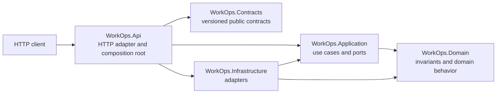

# WorkOps.Platform

A production-minded multi-tenant workflow API being built with ASP.NET Core and .NET 10.

> Portfolio project by Adnan Alloh, Senior .NET Backend Engineer. All names, users,
> organizations, data, and infrastructure values in this repository are synthetic.

## Status

**Foundation milestone - not yet a production release.** The repository currently provides a
compilable modular-monolith skeleton, health endpoints, architecture boundary tests, a pinned
container toolchain, and initial delivery/security documentation. Tenant isolation, OIDC,
persistence, messaging, caching, file handling, and the golden scenario are explicitly planned
and must not be treated as implemented yet. There is no hosted demo.

## Thirty-second overview

WorkOps.Platform is a focused backend portfolio project for workspaces that manage projects and
work items. Its purpose is to make difficult backend concerns easy to inspect: tenant-safe data
access, permission-based authorization, optimistic concurrency, transactional outbox processing,
idempotent background work, secure attachments, and production diagnostics.

The design is intentionally a compact modular monolith. It favors clear boundaries and traceable
tradeoffs over a large project graph or unnecessary distributed-system components.

## Architecture



See [architecture](docs/architecture.md) and
[ADR 0001: modular monolith](docs/adr/0001-modular-monolith.md).

## Golden scenario

The planned end-to-end scenario follows an authenticated workspace member creating and
transitioning a work item. The same transaction will persist the aggregate update, an audit event,
and an outbox message. A background worker will process the message idempotently. Tests will prove
cross-workspace denial, duplicate-message safety, and a `409 Conflict` for a stale concurrency
token. See [demo plan](docs/demo.md).

## Security highlights

Implemented in the foundation:

- nullable analysis and recommended .NET analyzers with warnings treated as errors;
- committed safe configuration only, with local-secret and key formats ignored;
- pinned stable SDK/runtime container tags and a non-root, read-only container configuration;
- minimal GitHub Actions permissions and full commit-SHA action pins;
- Gitleaks, dependency review, CodeQL, and NuGet audit configuration;
- dependency-direction tests for the initial architecture.

Planned controls are documented in [security](docs/security.md) and the
[threat model](docs/threat-model.md). This project does not claim security certification.

## Quick start

Prerequisites: .NET SDK `10.0.302` or a compatible allowed patch, and optionally Docker.

```bash
git clone https://github.com/adnanjalloh/WorkOps.Platform.git
cd WorkOps.Platform
dotnet restore --locked-mode
dotnet test -c Release --no-restore
dotnet run --project src/WorkOps.Api
```

Then open `http://localhost:5000/health/live` using the URL printed by ASP.NET Core.

Docker:

```bash
cp .env.example .env
docker compose up --build
```

PowerShell:

```powershell
Copy-Item .env.example .env
docker compose up --build
```

## Testing

```bash
dotnet format --verify-no-changes --no-restore
dotnet build -c Release --no-restore
dotnet test -c Release --no-build --logger "trx" --collect:"XPlat Code Coverage"
```

The current tests are foundation checks: server liveness, identifier creation, assembly loading,
and dependency direction. The full strategy and honest gaps are in [testing](docs/testing.md).

## Review paths

- **2-minute hiring-manager tour:** this overview -> [architecture](docs/architecture.md) -> [demo plan](docs/demo.md)
- **10-minute backend review:** [project map](#repository-map) -> [architecture tests](tests/WorkOps.ArchitectureTests/DependencyRuleTests.cs) -> [roadmap](#roadmap)
- **Security review:** [threat model](docs/threat-model.md) -> [security controls](docs/security.md) -> [CI](.github/workflows/ci.yml)
- **Delivery review:** [CI](.github/workflows/ci.yml) -> [Dockerfile](Dockerfile) -> [operations](docs/operations.md)

## Repository map

- [`WorkOps.Api`](src/WorkOps.Api) - HTTP adapter and composition root
- [`WorkOps.Application`](src/WorkOps.Application) - use cases and provider-neutral ports
- [`WorkOps.Domain`](src/WorkOps.Domain) - domain invariants and behavior
- [`WorkOps.Infrastructure`](src/WorkOps.Infrastructure) - persistence and external adapters
- [`WorkOps.Contracts`](src/WorkOps.Contracts) - deliberately versioned public contracts
- [`tests`](tests) - unit, integration, functional, and architecture tests

## Roadmap

- [ ] Tenant and identity boundary with cross-workspace tests
- [ ] Project/work-item vertical slice with optimistic concurrency
- [ ] Transactional audit and outbox processing with idempotent notification delivery
- [ ] Tenant-aware caching, feature limits, and secure file attachments
- [ ] OpenTelemetry, structured logging, rate limiting, and production hardening
- [ ] Reproducible golden-scenario demo and release evidence

See [CHANGELOG](CHANGELOG.md), [CONTRIBUTING](CONTRIBUTING.md), and [SECURITY](SECURITY.md).
A license will be selected deliberately before public release.
