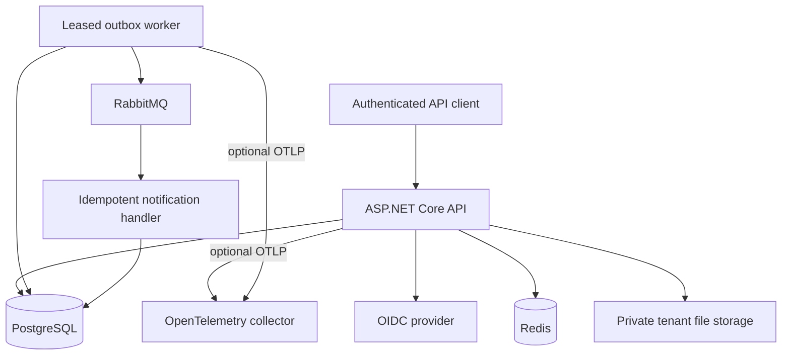
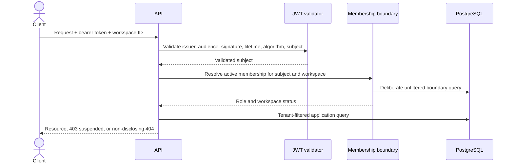
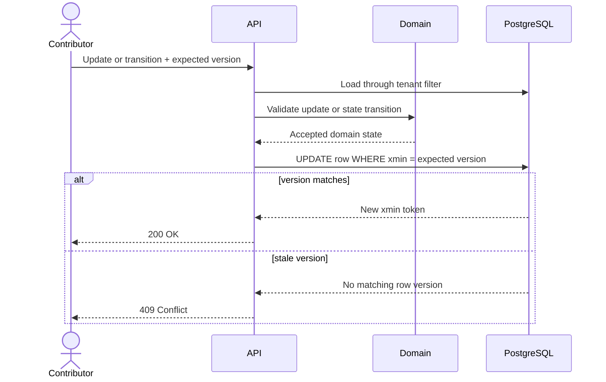
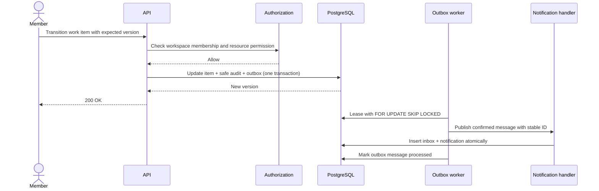

# Architecture

## Current scope

The portfolio release candidate carries the business slice through reliable delivery, feature
enforcement, tenant-aware caching, private attachments, production diagnostics, and a runnable
golden-scenario demo. The API validates external JWTs, establishes tenant context, and uses
tenant-filtered persistence for projects, work items, subscriptions, attachments, audit events,
outbox/inbox records, and notifications. Domain behavior owns project quotas, archiving, work-item
transitions, and the outbox failure state.

| Project | Role | Allowed project dependencies |
|---|---|---|
| `WorkOps.Domain` | Invariants and domain behavior | None |
| `WorkOps.Application` | Use cases and provider-neutral ports | Domain |
| `WorkOps.Infrastructure` | Persistence and external adapters | Application, Domain |
| `WorkOps.Contracts` | Versioned HTTP contracts | None |
| `WorkOps.Api` | HTTP adapter and composition root | All projects |

Architecture tests enforce that Domain has no project dependency, Application cannot reference API,
Contracts, or Infrastructure, tenant-owned entities declare their ownership boundary, and every
request string has a sanitization policy or an explicit skip reason.

## Current and planned runtime containers

Docker Compose runs the API, PostgreSQL, Redis, RabbitMQ, and a local identity provider with an
imported synthetic realm. Dynamic backchannel URLs let the API retrieve identity metadata and keys
over the private Compose network while tokens retain the public local issuer. The local attachment
adapter writes to an API-only temporary directory for demonstration; production object storage and
telemetry export remain future work.

## Tenant request path

Project and work-item rows carry a non-null workspace identifier. A composite foreign key prevents
a work item from pointing to a project in another workspace, while assignment is accepted only for
an active member of the current workspace.

## Implemented work-item sequence

## Implemented golden-scenario sequence

The transport is deliberately at-least-once. A crash after broker confirmation but before the
outbox row is marked processed can publish the same message again; the tenant-scoped inbox key and
notification uniqueness constraint turn that retry into a no-op. Claims use short leases and
`FOR UPDATE SKIP LOCKED`; failures use deterministic exponential backoff with jitter, stop after
five attempts, and remain recoverable through a protected, audited replay endpoint. The RabbitMQ
consumer retries once before routing a persistent failure to a durable failed-message queue.

Cross-workspace access, stale versions, concurrent claims, real broker routing, and duplicate
delivery are covered by automated tests. Redis tests check distinct tenant keys and invalidation;
PostgreSQL tests check that concurrent project reservations cannot exceed the plan limit; storage
and HTTP tests check tenant-separated file paths and non-disclosing cross-workspace downloads. Tracing
and metrics cover requests, outbound HTTP, PostgreSQL, runtime, messaging, cache results, job
duration, and outbox backlog. OTLP export is disabled until an endpoint is configured.

## Feature and attachment paths

Feature reads cache only a safe entitlement snapshot under
`workops:{workspace-id}:features`. Writes enforce the active-project limit against the tenant-filtered
subscription row in PostgreSQL, then invalidate the cache. A short Redis lock limits concurrent
cache fills; cache unavailability falls back to PostgreSQL, so Redis never becomes the authority for
the quota.

Attachments are loaded through a tenant-filtered work item, bounded in memory, checked against an
extension/media-type/signature allowlist, scanned through a port, hashed, and stored with a generated
name. Metadata is committed only after storage succeeds; a failed database commit triggers a
best-effort file delete. Downloads first resolve tenant-filtered metadata and then open the private
tenant path.

## HTTP reliability and diagnostics

Every request receives a server-generated correlation identifier derived from the active trace and
returned in `X-Correlation-Id`. Problem Details also carry correlation and trace identifiers. JSON
logs use the same structured scope without accepting caller-controlled correlation values.

Project creation optionally accepts `Idempotency-Key`. The application scopes a record by workspace,
authenticated user, method, canonical route, and sanitized key. It stores a SHA-256 hash of the
canonical sanitized request and the successful response in the same transaction as the project,
quota update, and audit event. An exact retry replays `201`; a changed request receives `409`; a
database primary key prevents two first writers from both committing. Expired records are replaced
on the next use of the same scoped key.

## Decisions

- [ADR 0001 - modular monolith](adr/0001-modular-monolith.md)
- [ADR 0002 - tenant isolation](adr/0002-tenant-isolation.md)
- [ADR 0003 - outbox delivery](adr/0003-outbox-delivery.md)
- [ADR 0004 - OIDC provider boundary](adr/0004-oidc-provider-boundary.md)
- [ADR 0005 - file storage security](adr/0005-file-storage-security.md)
- [ADR 0006 - HTTP idempotency](adr/0006-http-idempotency.md)
