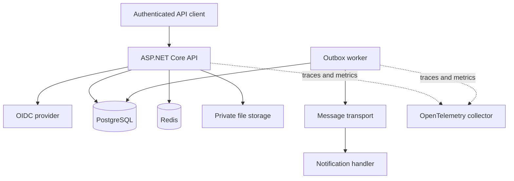
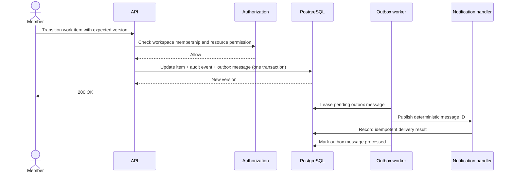

# Architecture

## Current scope

The current milestone establishes a five-project modular-monolith boundary and proves its basic
dependency direction. Business modules and external adapters are planned, not yet implemented.

| Project | Role | Allowed project dependencies |
|---|---|---|
| `WorkOps.Domain` | Invariants and domain behavior | None |
| `WorkOps.Application` | Use cases and provider-neutral ports | Domain |
| `WorkOps.Infrastructure` | Persistence and external adapters | Application, Domain |
| `WorkOps.Contracts` | Versioned HTTP contracts | None |
| `WorkOps.Api` | HTTP adapter and composition root | All projects |

Architecture tests currently enforce the two highest-value negative rules: Domain has no project
dependency, and Application cannot reference API or Infrastructure. More namespace and feature
rules will be added with the first vertical slice.

## Planned runtime containers

The current Docker Compose file intentionally runs only the API because the other dependencies are
not implemented yet.

## Planned golden-scenario sequence

Cross-workspace access and stale versions will be tested as non-disclosing denial and `409
Conflict`, respectively.

## Decisions

- [ADR 0001 - modular monolith](adr/0001-modular-monolith.md)
- Tenant isolation, outbox delivery, identity-provider boundary, and file storage will each receive
  an ADR when their implementation is introduced.
