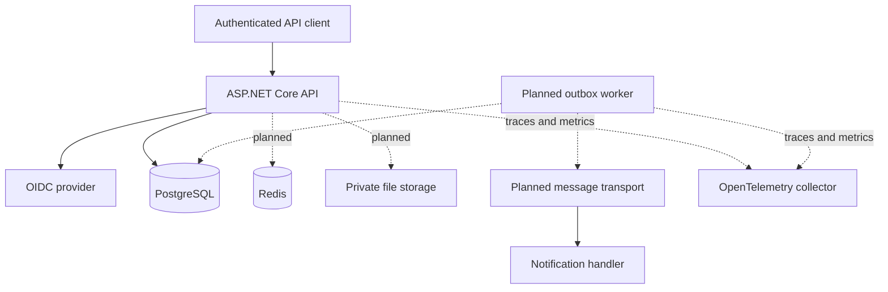
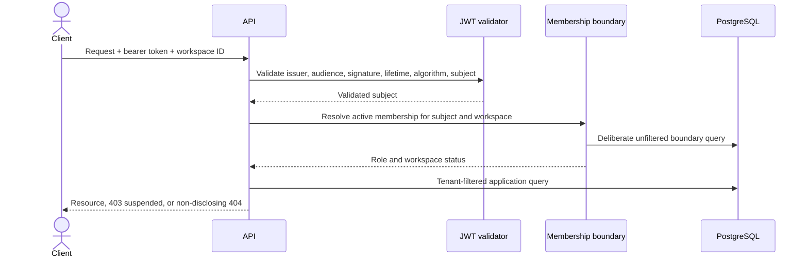
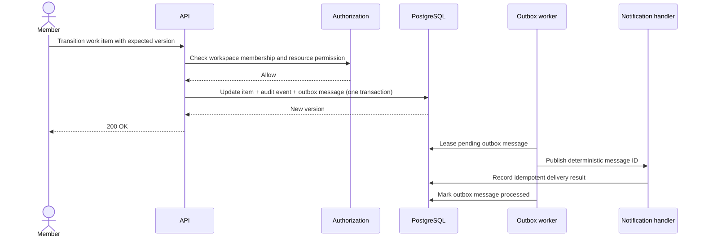

# Architecture

## Current scope

The current milestone establishes the five-project modular-monolith boundary and implements its
first vertical platform capability: identity and tenant isolation. The API validates external JWTs,
resolves an active workspace membership, establishes a request-scoped workspace context, and then
uses tenant-filtered persistence for normal reads.

| Project | Role | Allowed project dependencies |
|---|---|---|
| `WorkOps.Domain` | Invariants and domain behavior | None |
| `WorkOps.Application` | Use cases and provider-neutral ports | Domain |
| `WorkOps.Infrastructure` | Persistence and external adapters | Application, Domain |
| `WorkOps.Contracts` | Versioned HTTP contracts | None |
| `WorkOps.Api` | HTTP adapter and composition root | All projects |

Architecture tests enforce that Domain has no project dependency, Application cannot reference API,
Contracts, or Infrastructure, tenant-owned entities declare their ownership boundary, and every
request string has a sanitization policy or an explicit skip reason.

## Current and planned runtime containers

Docker Compose currently runs the API, PostgreSQL, and a local identity provider with an imported
synthetic realm. Redis, message transport, file storage, and telemetry remain future milestones.

## Tenant request path

## Planned golden-scenario sequence

Cross-workspace access and stale versions will be tested as non-disclosing denial and `409
Conflict`, respectively.

## Decisions

- [ADR 0001 - modular monolith](adr/0001-modular-monolith.md)
- [ADR 0002 - tenant isolation](adr/0002-tenant-isolation.md)
- Outbox delivery and file storage will each receive an ADR when introduced.
