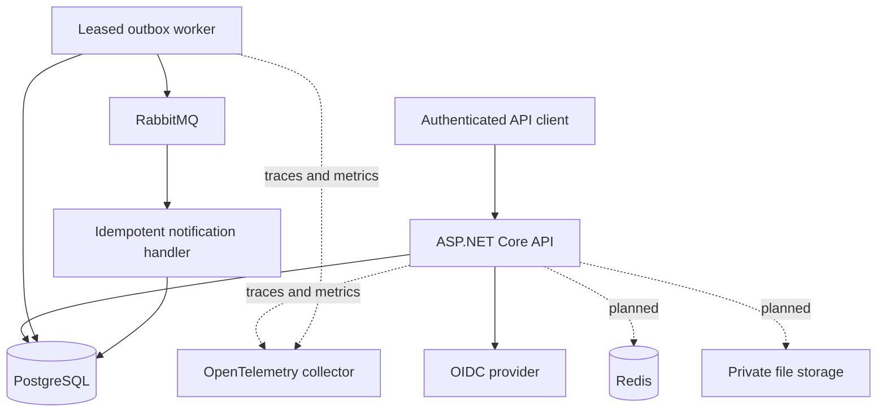
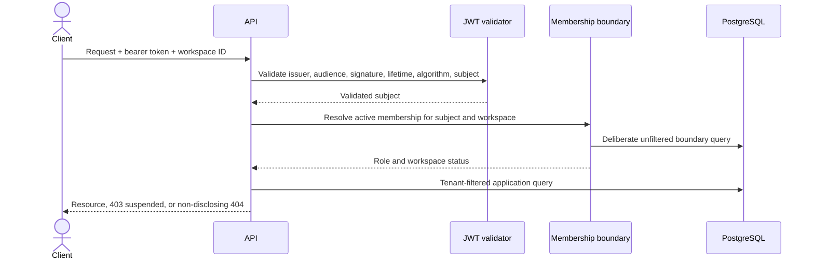
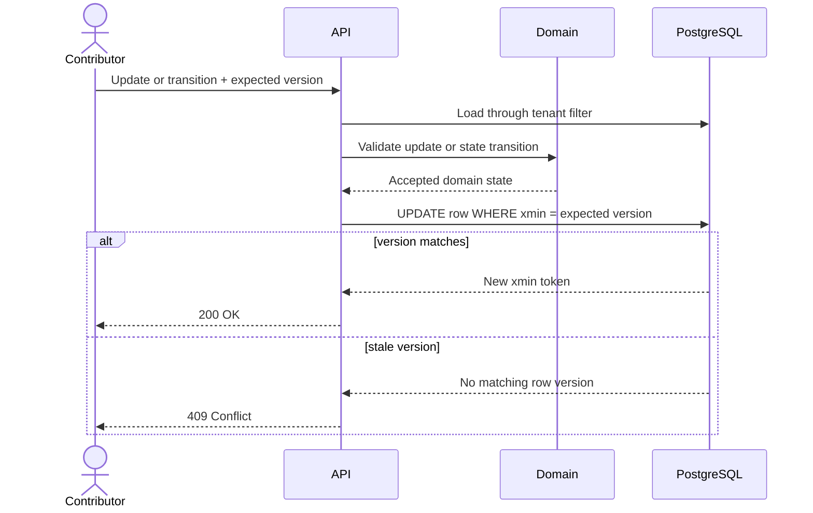
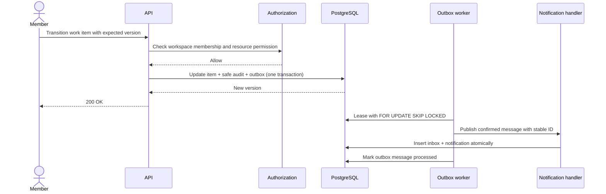

# Architecture

## Current scope

The current milestone carries the first business slice through reliable asynchronous delivery. The
API validates external JWTs, establishes tenant context, and uses tenant-filtered persistence for
projects, work items, audit events, outbox/inbox records, and notifications. Domain behavior owns
project archiving, work-item transitions, and the outbox failure state.

| Project | Role | Allowed project dependencies |
|---|---|---|
| `WorkOps.Domain` | Invariants and domain behavior | None |
| `WorkOps.Application` | Use cases and provider-neutral ports | Domain |
| `WorkOps.Infrastructure` | Persistence and external adapters | Application, Domain |
| `WorkOps.Contracts` | Versioned HTTP contracts | None |
| `WorkOps.Api` | HTTP adapter and composition root | All projects |

Architecture tests enforce that Domain has no project dependency, Application cannot reference API,
Contracts, or Infrastructure, tenant-owned entities declare their ownership boundary, and every
request string has a sanitization policy or an explicit skip reason.

## Current and planned runtime containers

Docker Compose currently runs the API, PostgreSQL, RabbitMQ, and a local identity provider with an
imported synthetic realm. Redis, file storage, and telemetry remain future milestones.

## Tenant request path

Project and work-item rows carry a non-null workspace identifier. A composite foreign key prevents
a work item from pointing to a project in another workspace, while assignment is accepted only for
an active member of the current workspace.

## Implemented work-item sequence

## Implemented golden-scenario sequence

The transport is deliberately at-least-once. A crash after broker confirmation but before the
outbox row is marked processed can publish the same message again; the tenant-scoped inbox key and
notification uniqueness constraint turn that retry into a no-op. Claims use short leases and
`FOR UPDATE SKIP LOCKED`; failures use deterministic exponential backoff with jitter, stop after
five attempts, and remain recoverable through a protected, audited replay endpoint. The RabbitMQ
consumer retries once before routing a persistent failure to a durable failed-message queue.

Cross-workspace access, stale versions, concurrent claims, real broker routing, and duplicate
delivery are covered by automated tests. Full tracing and exported metrics are planned for the
production-hardening milestone; the current code emits low-cardinality messaging result counters.

## Decisions

- [ADR 0001 - modular monolith](adr/0001-modular-monolith.md)
- [ADR 0002 - tenant isolation](adr/0002-tenant-isolation.md)
- [ADR 0003 - outbox delivery](adr/0003-outbox-delivery.md)
- File storage will receive an ADR when introduced.
